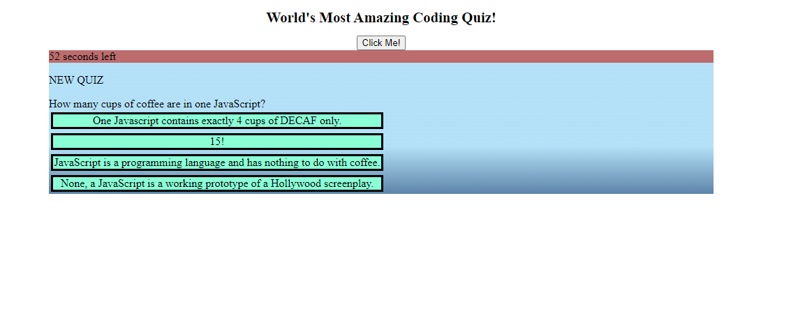

# SoYouThinkYouCanCode-Quiz

# Description
A not so serious quiz, demonstrating use manipulation of the Document-Object-Model using built the built in browser API methods.
The quiz has a predetermined set of questsion and answers. 

# Screenshots

# URL
https://josheflin.github.io/SoYouThinkYouCanCode-Quiz/

